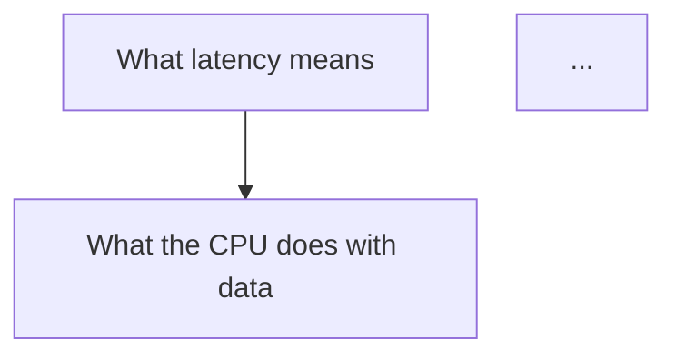

# New subject

Four steps. Steps 1–2 are usually one session (~15–20 min) — end it with `/wrap` so it counts.
Steps 3–4 can continue the same day if I have energy, or become the next session.

## 0. Setup
- Ask what the subject is (if I didn't say). Pick a short kebab-case slug (e.g.
  `system-design-hft`) and a 2–4 letter card prefix (e.g. `shft`).
- Create `subjects/<slug>/` with `lessons/`, `exercises/`, and `cards.md` containing just
  `# Cards: <Subject name>`.

## 1. Placement quiz (~10–15 questions)
Find the **edge** of what I know: the point where "I get this" turns into "I don't".

- First list the 3–5 **strands** (sub-areas) the subject depends on. For system design → HFT,
  e.g.: networking basics, how computers/CPUs work, concurrency, classic system design, markets
  & trading basics. Quiz every strand.
- Use `AskUserQuestion`, 3 options + "I don't know" (option-building rules in `teach`).
  Up to 4 questions per call is fine, but adapt between calls.
- **Adaptive, like a binary search:** right → jump noticeably harder. Wrong → probe around it
  to tell a slip from a real gap or a wrong mental model. A strand is mapped only when I've
  got one right (floor) AND one wrong/IDK (ceiling). All-correct means the questions were too easy.
- Tell me upfront: "This isn't a test you can fail. Guessing is good for memory; 'I don't know'
  is a perfectly useful answer."
- Keep it moving and light. Give ✓/✗ + one-line why after each batch.
- Save results to `subjects/<slug>/placement.md`: per strand — what I know (floor), where it runs
  out (ceiling), misconceptions spotted, plus the questions asked (question · my answer · ✓/✗).

## 2. Goal questions
What do I actually want? Ask with `AskUserQuestion` (no grading), one or two at a time,
until the goal is concrete and testable. For system design → HFT, clarify things like:
- understand how HFT systems are built vs build a toy version myself vs pass interviews
- how deep into hardware / C++ / networking I want to go
- a rough time horizon
Write the final goal as one sentence starting with "I will be able to…".

## 3. Research the field
Before planning, use the `researcher` subagent (Task tool) to map the subject: the real
fundamentals, the standard learning order, common beginner misconceptions, and 2–3 genuinely
good free resources. Give it the subject, my goal, and my placement summary. Don't plan from
memory alone.

## 4. Build the roadmap (`_map.md`)
Plan the lessons as a dependency graph: foundations at the top, my goal at the bottom, every
arrow meaning "you need this first". Start the graph at my ceiling (don't re-teach what I
proved I know, don't start above what I have).

- Each node = one lesson (~12 min of teaching). Typically 10–25 nodes for a subject. Too big →
  split it.
- **Stress-test the roots:** for each foundation node, ask "can he accept this at face value,
  or does it rest on something simpler?" If it rests on something, add that below it.

Write `subjects/<slug>/_map.md`:

````markdown
---
type: map
subject: <slug>
title: <Subject name>
goal: "I will be able to …"
card_prefix: <prefix>
status: draft
nodes_total: <n>
nodes_solid: 0
next_node: <first node id>
started: YYYY-MM-DD
updated: YYYY-MM-DD
---
# <Subject name> — roadmap

> [!goal] Goal
> I will be able to …

## Why this order
<3–6 plain-language lines: where my knowledge ends (from placement) and how the path gets to the goal>

## The map


## Lessons
Status: ⬜ not started · 🟨 learning · ✅ solid (review cards sticking for 3+ weeks)

| Status | Node id | Lesson | Needs | Lesson notes |
|---|---|---|---|---|
| ⬜ | latency | What latency means | — | |
| ⬜ | cpu | What the CPU does with data | latency | |

## Change log
- YYYY-MM-DD: map created from placement + research.
````

Keep mermaid labels short (≤ 5 words). If the graph gets bigger than ~15 boxes, group
later parts into one box per phase and expand them when we get there.

Then **show me the plan** in the terminal: 3–5 lines on the approach + "full map is in
Obsidian". Ask for approval (`AskUserQuestion`: looks good / change something). Adjust until
approved, then set `status: active`.

## 5. Tooling
If the subject needs tools (a C++ compiler, Python packages…), check what's installed and
tell me the one-line install command. Don't install system-wide software without asking.

## 6. End
If this was the whole session, run the `wrap` skill (no cards needed if nothing was taught —
the placement quiz still counts as the day's session).
