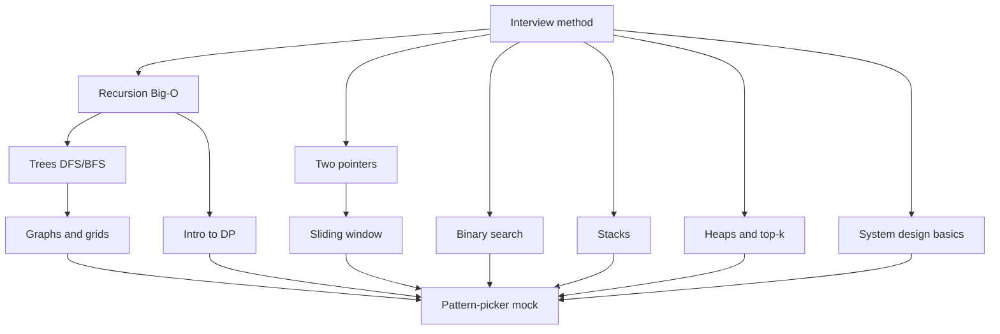

# Technical Interview Prep — roadmap

> [!goal] Goal
> I will be able to recognize and explain the core LeetCode patterns, plus heaps and recursion complexity, and talk through a basic new-grad system design question (including CAP and consistent hashing) in my interview on **2026-10-07**.

## Why this order
- **What you already know:** hash maps, Big-O for loops, memoization, and practical networking/caching. We won't re-teach those.
- **Where it runs out:** heaps, picking the *best* pattern (not just *a* pattern), Big-O for recursion, CAP, consistent hashing.
- **Lesson 1 is the interview method** (clarify → examples → brute force → optimize → say the complexity out loud). It's the most common way people fail, and every other lesson uses it.
- Then the highest-frequency patterns for new grads: two pointers, sliding window, binary search, trees/graphs, heaps.
- System design is rarely asked of new grads, so it gets **one** lesson, not a whole track.
- The last lesson is a mixed "which pattern is this?" drill, which works on your pattern-choice gap.

## 5-day schedule (~1 hr/day, 3 lessons/day)
| Day | Date | Lessons |
|---|---|---|
| 0 | Fri 10-02 | Placement quiz + this map ✔ |
| 1 | Sat 10-03 | approach · recursion-bigo · two-pointers |
| 2 | Sun 10-04 | sliding-window · binary-search · stack |
| 3 | Mon 10-05 | approach ✔ (sat/sun missed, so re-planned) |
| 4 | Tue 10-06 | Must-know first: recursion-bigo · heaps · sysdesign (CAP + consistent hashing) · two-pointers. Then sliding-window / binary-search / trees if time allows |
| 5 | Wed 10-07 | Interview day: reviews only (`/quick`) |

## The map

## Lessons
Status: ⬜ not started · 🟨 learning · ✅ solid (review cards sticking for 3+ weeks)

| Status | Node id | Lesson | Needs | Lesson notes |
|---|---|---|---|---|
| 🟨 | approach | The interview method: clarify, brute force, optimize, state complexity, think out loud | — | [[2026-10-05 The interview method]] |
| ⬜ | recursion-bigo | Big-O for recursion: recursion trees (why naive Fibonacci is exponential) | approach | |
| ⬜ | two-pointers | Two pointers, and when it beats hashing or binary search | approach | |
| ⬜ | sliding-window | Sliding window (e.g. longest substring without repeats) | two-pointers | |
| ⬜ | binary-search | Binary search as a pattern, not just "find x in a sorted array" | approach | |
| ⬜ | stack | Stacks and monotonic stacks (valid parentheses, next greater element) | approach | |
| ⬜ | trees | Tree traversal: DFS (recursive) vs BFS (queue) | recursion-bigo | |
| ⬜ | graphs | Graphs and grids: BFS/DFS, visited sets, number of islands | trees | |
| ⬜ | heaps | Heaps and top-k: what a heap is, `heapq`, k-th largest | approach | |
| ⬜ | dp | Intro to dynamic programming: from memoization to a table (climbing stairs, house robber) | recursion-bigo | |
| ⬜ | sysdesign | System design basics: CAP theorem and consistent hashing, on top of the caching and load balancing you already know | approach | |
| ⬜ | mock | Pattern-picker drill + one timed mock problem | all above | |

> [!note] Cut list if time runs short
> Drop in this order: `stack` → `dp` → `sysdesign`. Never drop `approach` or `mock`.

## Resources
- [NeetCode 150](https://neetcode.io/) — problems grouped by pattern, with videos
- [Tech Interview Handbook](https://www.techinterviewhandbook.org/) — cheat sheets + interview method
- [System Design Primer](https://github.com/donnemartin/system-design-primer) — CAP, consistent hashing, caching

## Change log
- 2026-10-02: map created from placement + research. Fit to a 5-day window (interview 2026-10-07). Approved.
- 2026-10-05: Sat/Sun missed. Day 4 re-planned to put the goal's named topics first (recursion Big-O, heaps, CAP, consistent hashing) plus two-pointers. Learner gap seen today: knows the idea but doesn't link "seen before / how many" → hash set / hash map, and didn't know Python dict = hash map.
