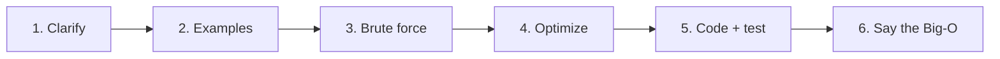

# The interview method

> [!question] Why we need this
> Lots of people who *could* solve the problem still fail the interview.
> They jump straight into code, go quiet, get stuck, and the interviewer has nothing to grade.
> The method is a fixed set of steps you run on **every** problem, so you never freeze and the interviewer always sees how you think.

## 1. Clarify before you touch anything

> [!check]- Your guess
> Q: Interviewer gives two-sum and goes quiet. First move?  ·  Your answer: "How big can the list go? What time complexity are we looking for?"  ·  ✓ Right instinct: **ask before building.**

**Metaphor:** a builder who starts pouring concrete before asking "how many floors?" builds the wrong house fast.
Clarifying questions are you asking "how many floors?"

**Why it matters in interviews:**
- Problems are left **vague on purpose**. Part of the test is whether you notice.
- The answers often **change which pattern is best**, so the right question can hand you the solution.

### The clarify checklist: Input → Output → Edge cases

| Ask about | Example questions (two-sum) | Why it matters |
|---|---|---|
| **Input size** | "How big can the list get?" | Tells you roughly what Big-O you need, so you don't have to ask that directly |
| **Input shape** | "Is it **sorted**? Negatives? Duplicates?" | Sorted → two pointers in $O(n)$ with no extra memory |
| **Output** | "Return the numbers or their **indices** (positions)? Always exactly one answer?" | Changes what you have to keep track of |
| **Edge cases** (weird inputs at the extremes) | "Empty list? No pair exists, so what do I return?" | Shows you're careful. Interviewers note it |

> [!warning] About "what complexity are you looking for?"
> It isn't wrong, but asking about **input size** is stronger. It shows *you* can work out the target.
> Rough guide: $n \le 1000$ → $O(n^2)$ is probably fine · $n$ up to $10^5$–$10^6$ → aim for $O(n)$ or $O(n \log n)$.

> [!example] Example: one question changes everything
> "Is the list sorted?"
> - **No** → hash set: for each number $x$, check if $\text{target} - x$ is already in the set. $O(n)$ time, $O(n)$ memory.
> - **Yes** → two pointers, one at each end. Sum too big → move right pointer left. Too small → move left pointer right. $O(n)$ time, $O(1)$ memory.
>
> This is the exact question from your placement quiz. Asking "is it sorted?" would have pointed you at two pointers.

> [!check]- Quick check
> Q: "Return the most frequent word." 2–3 clarifying questions?  ·  Your answer: "How big can the list get? Sorted or unsorted?"  ·  🟨 Half right. Good **input** questions, but nothing about the **output** or **edge cases**.
> Missing: **"What if two words tie?"** (the best question here) · "Is 'The' the same as 'the'?" · "Empty list?"
> Tip: run the checklist in order, **Input → Output → Edge cases**, so you don't stop after the input questions.

## 2. Example by hand → brute force, out loud

> [!check]- Your guess
> Q: Why say the slow idea out loud?  ·  Your answer: "To show the interviewer my thought process, and where we can start optimizing from."  ·  ✓

**Metaphor:** a climber clips into a safety rope before trying the hard route. Brute force is your rope.
If the clever idea never comes, you still have a working answer, and that scores far better than a blank screen.

**Step 2a: solve one small example by hand, out loud.**
- Pick a tiny input, like `[2, 7, 11, 15]`, target `9`, and solve it like a human would.
- This catches misunderstandings *before* you code. The interviewer can correct you early.
- How you solved it by hand is often a hint for the algorithm.

**Step 2b: say the brute force + its Big-O.**
- "Simplest idea: try every pair. Two nested loops, so $O(n^2)$ time, $O(1)$ extra memory."
- Don't code it yet, just *say* it, unless you're truly stuck. Then ask: *"Should I code this, or try to optimize first?"*

Why this works (your answer, plus one more reason):
1. The interviewer **sees your thinking**. That's half of what they grade.
2. It's the **starting point for optimizing**. Next step: find what the brute force wastes.
3. It's the **safety net** if time runs out.

## 3. Optimize: find the repeated question, then pick the tool that answers it fast

> [!check]- Your guess
> Q: What question does the inner loop keep asking, and what tool answers it instantly?  ·  Your answer: "Is this pair equal to target? Not sure about the tool."  ·  🟨 True, but it's phrased in a way that hides the tool.

**The trick: rephrase the inner loop from the point of view of a single `x`.**
Once `x` is fixed, there's only one `y` that works: $y = \text{target} - x$.
So the inner loop is really asking: **"Is the number $\text{target} - x$ anywhere in the list?"**

**Metaphor:** you're at a party looking for "Sam".
- Brute force = walk around and ask every guest their name. $O(n)$ per search.
- Better = check the **guest list at the door**. One glance. $O(1)$.
A **hash set** is that guest list. You already know it from the placement quiz.

> [!example] Two-sum, optimized
> List `[2, 7, 11, 15]`, target `9`. Walk the list once and keep a set of numbers seen so far:
> - `x = 2` → is `9 − 2 = 7` in the set `{}`? No. Add 2 → `{2}`
> - `x = 7` → is `9 − 7 = 2` in the set `{2}`? **Yes** → answer (2, 7)
>
> One pass: $O(n)$ time, $O(n)$ memory. We **traded memory for time**, which is the most common optimization there is.

### The repeated question names the tool

| If the slow part keeps asking… | Reach for… | Lesson |
|---|---|---|
| "Is X in here?" / "How many times have I seen X?" | **Hash set / hash map** | known ✓ |
| "Pair or triple in a **sorted** list?" | **Two pointers** | coming |
| "Where's the first position where a condition flips?" (sorted / yes-no range) | **Binary search** | coming |
| "Best **contiguous** stretch (substring / subarray)?" | **Sliding window** | coming |
| "What's the smallest / largest *right now*?" / "Top $k$?" | **Heap** | coming |
| "Am I solving the same sub-problem again?" | **Memoization / DP** | coming |

This table is the backbone of the whole roadmap. Each future lesson fills in one row.

> [!check]- Quick check
> Q: "Does the list contain duplicates?" What question does the slow part repeat, and what fixes it?  ·  Your answer: "Have I seen this number before? Not sure what fixes it."  ·  🟨 **Perfect question**, missed the tool.
> Fix: **hash set**. For each number: in the set already → duplicate found. Not in it → add it. $O(n)$ time, $O(n)$ memory.

> [!warning] The link to burn in
> **"Have I seen…?" / "Is … in here?" / "How many times…?" → hash set (or hash map for counts).**
> Metaphor: a nightclub **hand stamp**. The bouncer doesn't remember every face. He checks your hand: stamped means you've been here before. Checking takes one glance, $O(1)$.
> You're already good at spotting the repeated question. Now train the reflex: *"seen before" = hash set.*

> [!check]- Re-check
> Q: First letter that appears only once (`"aabcc"` → `b`). Repeated question + tool?  ·  Your answer: "How many times the letter appears, hash set."  ·  🟨 Question ✓, tool **almost**. You're asking *how many*, so you need a **hash map**.

### Hash set vs hash map
- **Hash set** = stores *yes/no*: "is it in here?" Like the hand stamp.
- **Hash map** (Python `dict`) = stores *key → value*: "how many times?", "at which index?" Like a coat check that hands you a numbered ticket.

> [!example] First unique letter, `"aabcc"`
> Pass 1, count: `{a: 2, b: 1, c: 2}`
> Pass 2, walk the string again: `a` → 2 ✗, `a` → 2 ✗, `b` → 1 ✓ → return `b`
> Two passes, each $O(n)$, so $O(n)$ in total.

## 4. Before you say "done": test it, then state the Big-O

> [!check]- Your guess
> Q: Code is written. What 2 things before saying "done"?  ·  Your answer: "Test the code with a test case to check edge cases, then make changes."  ·  🟨 1 of 2. Testing ✓. Missing: **say the time + space complexity out loud.**

**Metaphor:** a pilot runs the checklist before takeoff, even after 1,000 flights. It's quick and it catches the dumb mistakes.

**Step 5: test, in this order**
1. **Dry run** (trace the code by hand, line by line) on your normal example. Say the variable values out loud: "now `seen` is `{2}`…"
2. **Edge cases**: empty input, one element, no answer, duplicates, negatives.
3. Found a bug? Fix it calmly and say what was wrong. Finding your own bug *scores points*.

**Step 6: say the complexity out loud, without being asked**
- "Time is $O(n)$ because we visit each element once and each set lookup is $O(1)$ on average."
- "Space is $O(n)$ for the set."
- Always give **both** time *and* space, plus a short "because".

> [!example] The whole method in one breath
> **Clarify** (input → output → edge cases) → **Example** by hand → **Brute force** + Big-O → **Optimize** (find the repeated question → pick the tool) → **Code + test** → **State Big-O** (time + space, with a "because").

> [!note] Build exercise
> [[2026-10-05 Valid anagram - full method]]: you ran the method on "valid anagram". Big lesson: **Python `dict` = hash map**, so your "brute force" was already the fast answer.

## Recap
- **Clarify first**, in order **Input → Output → Edge cases**. Ask for the input *size* instead of the target complexity. "Is it sorted?" can hand you the pattern.
- **Example by hand, then brute force out loud** with its Big-O. It shows your thinking, gives you a starting point, and it's your safety net.
- **Optimize = find the question the slow part keeps asking**, then pick the tool that answers it fast ("seen before?" → hash set, "how many?" → hash map).
- **Python `dict` = hash map, `set` = hash set.** Same tools, interview names.
- **Before "done":** dry run + edge cases, then say **time AND space** complexity with a "because".
